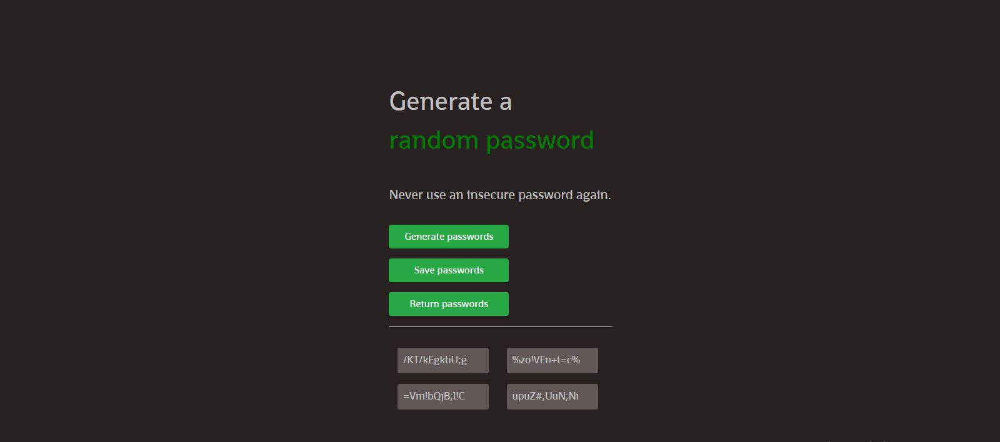
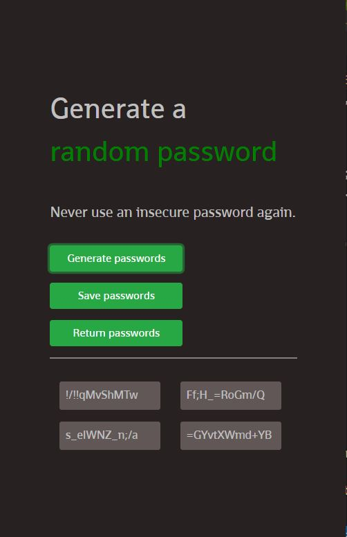

# password_generator
 A simple password generator that randomly generates 4 passwords and allows you to save them and return them.

# Password Generator - Solo project on Scrimba Frontend Career Path

A simple password generator that randomly generates 4 passwords and allows you to save them and return them. Length of every password is 12 randomly chosen characters (uppercase and lowercase letters, and characters). It's been made as Solo project on [Frontend Career Path](https://scrimba.com/learn/frontend). 

## Table of contents

- [Overview](#overview)
  - [Screenshot](#screenshot)
  - [Links](#links)
- [Process](#process)
  - [Built with](#built-with)
- [Author](#author)

## Overview

Users are allowed to: 
- generate new passwords that will display on the screen
- save a sequence of 4 passwords (they get saved to localStorage)
- return saved passwords at any time

### Screenshot

### Links

- Live Site URL: [Color Scheme Generator](https://jelenkoo10.github.io/color_scheme_generator/)

## Process

### Built with

- CSS Grid
- localStorage interaction via JavaScript

## Author

- GitHub - [https://github.com/jelenkoo10](https://github.com/jelenkoo10)
- Frontend Mentor - [@jelenkoo10](https://www.frontendmentor.io/profile/jelenkoo10)

